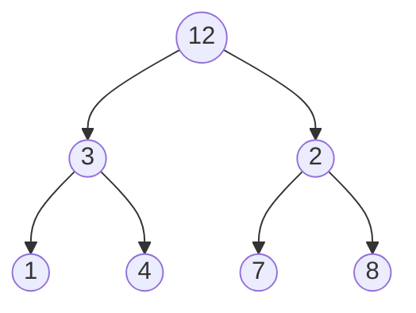

##实验目的：

1．掌握二叉树的定义；

2．掌握二叉树的基本操作，如二叉树的建立、遍历、结点个数统计、树的深度计算等。

##实验内容：

用递归的方法实现以下算法：

1．以二叉链表表示二叉树，建立一棵二叉树（算法5.3）；

2．输出二叉树的中序遍历结果（算法5.1）；

3．输出二叉树的前序遍历结果（见讲稿）；

4．输出二叉树的后序遍历结果（见讲稿）；

5．计算二叉树的深度（算法5.5）；##Hush

6．统计二叉树的结点个数（算法5.6）；

7．统计二叉树的叶结点个数；

8．统计二叉树的度为1的结点个数；

9．输出二叉树中从每个叶子结点到根结点的路径。

##选做内容

1．交换二叉树每个结点的左孩子和右孩子；

2．设计二叉树的双序遍历(DblOrderTraverse)算法（双序遍历是指对于二叉树的每一个结点来说，先访问这个结点，再按双序遍历它的左子树，然后再一次访问这个结点，接下来按双序遍历它的右子树）。

##实验提示：

7．统计二叉树的叶结点个数

`int LeafNodeCount(BiTree T ){
如果是空树，则叶子个数为0;
如果是叶子结点，则叶子结点个数为1（如何表示叶子结点？？？）
否则叶结点个数为左子树的叶结点个数+右子树的叶结点个数
}
`

##实验要求：

(1) 程序要具在一定的健壮性，即当输入数据非法时，程序也能适当地做出反应。

(2) 程序要添加适当的注释，程序的书写要采用缩进格式。

(3) 根据实验报告模板详细书写实验报告,上交一份实验报告打印稿。

